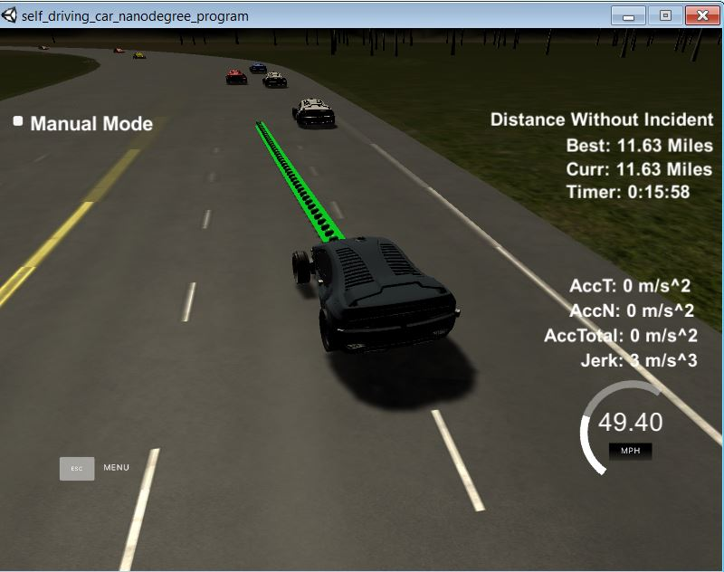

# CarND-Path Planning
Self-Driving Car Engineer Nanodegree Program

---

## Project Introduction
In this project the goal is to safely navigate around a virtual highway with other traffic that is driving +-10 MPH of the 50 MPH speed limit. 
The car's localization and sensor fusion data is provided, there is also a sparse map list of waypoints around the highway. 
The car successfully goes as close as possible to the 50 MPH speed limit, which means passing slower traffic when possible. 
Note that other cars can also change lanes. The car avoids hitting other cars at all cost as well as drives inside of the marked road lanes 
at all times, unless going from one lane to another. The car is be able to make one complete loop around the 6946m highway. 
Since the car is trying to go 50 MPH, it should takes little over 5 minutes to complete 1 loop. Also the car does not experience 
total acceleration over 10 m/s^2 and jerk that is greater than 10 m/s^3. Following snapshot from simualtor shows one successful run.

#### Submission
This repository contains all the code needed to complete the Path Planning Project.

## Running the Code
This project involves the Term 3 Simulator which can be downloaded [here](https://github.com/udacity/self-driving-car-sim/releases/tag/T3_v1.2). 
My setup is done using windows with docker installed. The remaining setup was done as a linux system. The main protcol is that main.cpp uses for uWebSocketIO in communicating with the simulator.
1. Clone this repo.
2. Make a build directory: `mkdir build && cd build`
3. Compile: `cmake .. && make`
4. Run it: `./path_planning`.

Tips for setting up the environment can be found [here](https://classroom.udacity.com/nanodegrees/nd013/parts/40f38239-66b6-46ec-ae68-03afd8a601c8/modules/0949fca6-b379-42af-a919-ee50aa304e6a/lessons/f758c44c-5e40-4e01-93b5-1a82aa4e044f/concepts/23d376c7-0195-4276-bdf0-e02f1f3c665d)

## Implementation

### Description of States
4 states for the car are defined
1. Remain in current lane: If there is no car in front then the car remaines in state 1
2. Prepare to change lane: If there is a car in front but there is not enough clearance both on left or right side, then car is in state of preparing to change lane.
3. Change lane left: If there is a car in front but there is enough clearance in left lane, then car goes in this state.
4. Change lane right: If there is a car in front and there is not enough clearance in left lane but there is enough clearance in right line, then car goes in this state.

### Clearance Estimation
Clearance estimation is done using the sensor fusion information. Using the d value of the other cars, the lane in which each car is identified. Depending on which lane the car is clearance condition is chosen. For the decision the positon of the car is predicted using its current position,
current speed and number of samples in previous path.
1. Front Clearance Estimation: If a car in front is within range of 0m to 30m along s coordinate then lane is considered not clear.
2. For left and right clerance estimation: If a car in left or right late is withing range of -10m to 50m  along s coordinate then lane is considered not clear.

### Decision on car speed change
If car is in state 1 or 3 or 4 which is Remain in current lane or Change lane left or right, then the car keeps accelerating slowly to reach the maximum velocity. 
If car is in state 2 which is Prepare to change lane, then car tries to reach the speed of the car in front. If it is fast, then accelerate else decelerate.

### Decision on Lane Change
If the car state is in Change lane left or right, lane change is initiated by changing the target lane value. The car remains in lane change state once the lane change is not complete.
Lane change is considered complete when the car's d coordinate is witin 1m of center of target lane.

### Guiding Path Points Estimation
Before estimating final x,y points, guiding path points are estimated. This is done by using the last 2 x,y points from previous path and estimating next 3 target x,y points. These are estimated with d using the target lane and s as 30m, 60m and 90m. 
Then these points are moved such that the last point is  in previous path 0,0 and rotated such that first two points have yaw as 0 deg. Then a spline is fit to these 5 points. This spline fit is then used to estimate the final path points. 

### Final Path Points Estimation
Path points are given as a list of 50 points. For next set of 50 path points first the previous path points left in the list are used. For new path points spline is evaluated at chosen x points to get y points. These x,y points are then moved again to last point and re rotated to world yaw. Thes transfored 
x,y points are then added to the list to make 50 points again. In order to chose x at which spline has to be evaluated, a reference distance of 30m is chosen in x. Y position at 30m is evaluated using the spline. Then euclidian distance is calculated using this 30m and evaluated y position. 
This distance is then divided in N points using the reference velocity in metres/frame. `Speed in meters per frame = Velocity in miles per hour/2.24*0.02`.

The number of points are less if the path is linear and larger if the path is curved and it to an extent make sures that speed remains reference velocity throughout the path. 
Then delta x is obtained by dividing 30 by N. Chosen x points are obtained by adding delta x for every new point.

	
## Simulation
Following video shows how the car navigated with the final chosen parameters. 

[

It can be observed that the car was able to remain on track thoughout the run.

## Scope of Improvement
It is assumed that other cars will behave in usual manner. In case there is any emergency situation or a crash or a sudden stop/acceleration of other cars, the following methods may not be sufficient.
